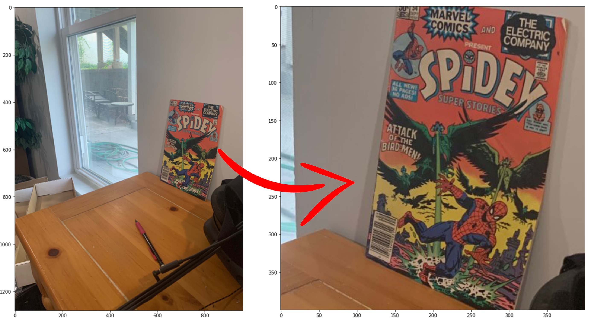

## Comic Book Classification! Spiderman? Batman? Which Hero?!

In this repository, we tried to tackle commic book classification with a naive approach while using two classic algorithms, namely KMeans for creating Bag of Visual Words and Support Vector Machine. In this small software, we first detect the comic book in scene, and then apply the pretrained classification to see which class of heros it belongs to. 

### Quick Run

For Running the application, you can simply run the following commands. Please note that we recommend you to run install the requirement.txt to make sure you have all the required packages. 

* Linux & Mac OS:
```python 
# To run the requirement.txt
pip3 install -r requirements.txt

# To run the program
python3 main.py
```

* Windows:
```python
# To run the requirement.txt
pip install -r requirements.txt

# To run the program
python main.py

```

### Run with Commandline arguments

You can also run the program by passing commandline arguments to the program. (The commandline flags are very limmited at the moment, but we plan to add more :)) 

```sh
python main.py [--path or -p]  TEST_FILE_PATH
```

### Comic Book Localization in a Scene 
<p align="center">
  
</p>


### Overall Evaluation and Conclusion: 

As mentioned previously, the current program tackle a complicated application with the conventional Computer Vision tools as well as some well-known class machine learning algorithms. However, with all this, this program isn't still accurate enough, but it has good enough for educational purposes. An improvement for future work can be applying more powerful methods, using Deep Convolutional Neural Networks alongside larger sets of image data to generalize the model.
